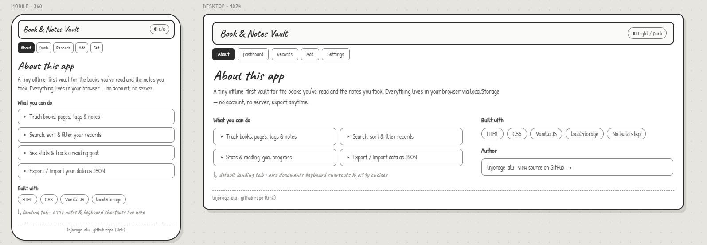
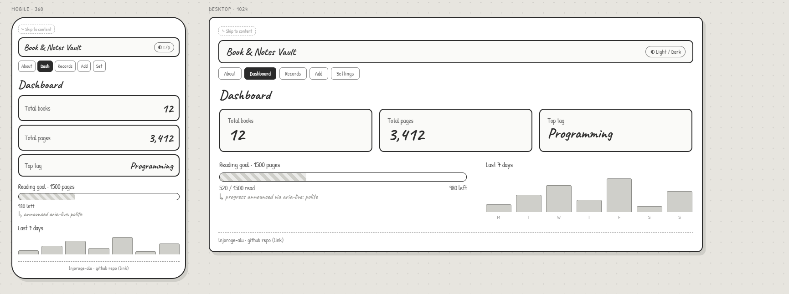
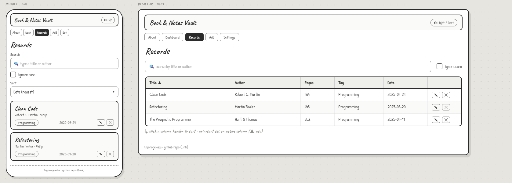
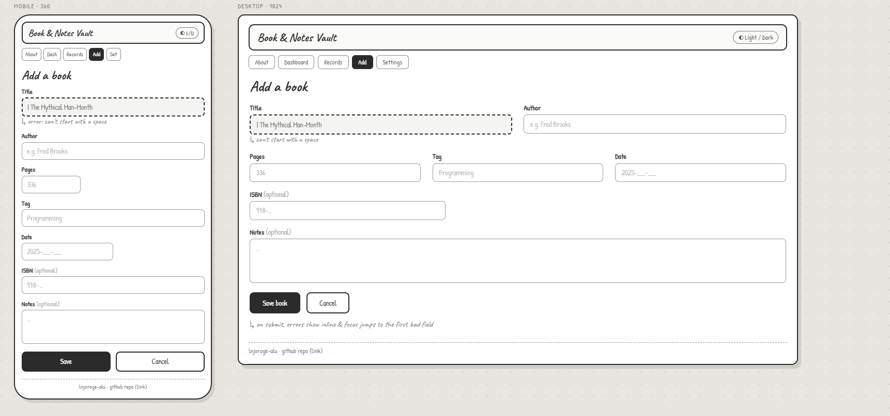
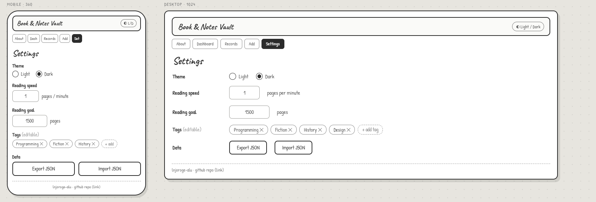

# Book & Notes Vault — My Plan (M1)

**Theme:** Book & Notes Vault
**Made by:** lnjoroge-alu · l.njoroge@alustudent.com
**Repo:** https://github.com/lnjoroge-alu/alu-fwd-summative
**Live page:** https://lnjoroge-alu.github.io/alu-fwd-summative/

This is my plan before I start coding. It shows what the app does, what one book looks
like as data, my rough screen sketches, and how I will make it work for everyone.

I am building it with plain HTML, CSS and JavaScript. No frameworks.

---

## What the app does

It is a small website to keep a list of the books and notes I read. I can:

- add a book (title, author, pages, tag, date),
- search through my books,
- see a few simple stats (like total books and total pages),
- and it saves everything in the browser so it is still there next time.

---

## The pages

It is one page with tabs at the top. Clicking a tab shows that section:

1. **About** – what the app is and how to contact me.
2. **Dashboard** – the stats.
3. **Records** – the list of books, with search.
4. **Add / Edit** – the form to add or change a book.
5. **Settings** – options and export/import.

---

## What one book looks like (data model)

Every book is saved as an object like this:

```js
{
  id: "bnv_0001",        // a unique id for each book
  title: "Clean Code",
  author: "Robert Martin",
  pages: 464,            // a whole number
  tag: "Programming",
  isbn: "978-0132350884", // optional
  notes: "Some notes",    // optional
  dateAdded: "2025-09-29",
  createdAt: "2025-09-29T10:00:00.000Z", // when I added it
  updatedAt: "2025-09-29T10:00:00.000Z"  // when I last changed it
}
```

All the books are kept in one list (an array). The whole list is saved in the browser's
`localStorage`. I can also download it as a JSON file and load it back later.

For the unit part of the task, Settings has a "reading speed" (pages per minute). I use it
to turn pages into an estimated reading time (minutes, and minutes into hours).

---

## My files

```
index.html        the page
tests.html        a page that runs small tests
seed.json         some example books to load
styles/
  base.css        colours and fonts
  layout.css      where things go (mobile first + bigger screens)
  components.css  the look of cards, the form, buttons
scripts/
  storage.js      save and load from the browser, and import/export
  state.js        the list of books and add/edit/delete
  validators.js   the regex rules for the form
  search.js       search and sorting
  ui.js           builds the HTML on screen
  app.js          starts everything and connects the buttons
```

How it works in simple steps:

```
I click a button  ->  the book list changes
                  ->  it gets saved
                  ->  the screen is drawn again
```

---

## Regex rules (checking the form)

The form must stop bad input. These are the patterns I will use:

| What | Pattern | In plain words |
|------|---------|----------------|
| Title | `/^\S(?:.*\S)?$/` | can't start or end with a space |
| Pages | `/^[1-9]\d*$/` | a whole number, no leading zero |
| Date | `/^\d{4}-(0[1-9]|1[0-2])-(0[1-9]|[12]\d|3[01])$/` | looks like YYYY-MM-DD |
| Author / tag | `/^[A-Za-z]+(?:[ -][A-Za-z]+)*$/` | letters, with single spaces or hyphens |
| **Advanced** | `/\b(\w+)\s+\1\b/i` | finds a word typed twice, like "the the" |

The last one is the advanced rule. The `\1` means "the same word as before", so it catches a
repeated word. I also use it as a search example.

I will also show these search examples in the app:
- `\b\d{2}:\d{2}\b` – finds times like `09:30` in the notes.
- `\.\d{2}\b` – finds numbers with two decimals.

---

## My sketches (wireframes)

Rough drawings of each screen before styling. The top bar (title, tabs, footer) is the same
on every screen; only the middle part changes.

**About**



**Dashboard**



**Records**



**Add / Edit**



**Settings**



---

## Making it work for everyone (accessibility)

I want the app to work with a keyboard and a screen reader, not just a mouse.

- I use proper tags: `<header>`, `<nav>`, `<main>`, `<section>`, `<footer>`.
- One `<h1>` for the app name, then `<h2>` for each section. No skipped levels.
- A "Skip to main content" link at the very top for keyboard users.
- Every input has its own `<label>`.
- A clear outline shows where the keyboard focus is.
- A small message area tells the user when something happens (like "Book added"). When the
  reading goal is passed, the message is more urgent so it gets read out.
- Colours have enough contrast in both light and dark mode, and I never use colour alone.
- Everything can be done with the keyboard: Tab to move, Enter/Space to press, Esc to cancel.

---

## Screen sizes

I design for phones first, then add changes for bigger screens:

- about 360px (phone): one column, books shown as cards.
- about 768px (tablet): books shown as a table, two columns where it helps.
- about 1024px (laptop): a bit more space.

---

## Testing

`tests.html` runs small checks with `if` statements and prints pass or fail. It checks:

- each regex rule (good input passes, bad input fails),
- the search still works when someone types a broken pattern,
- saving and loading gives back the same data.
